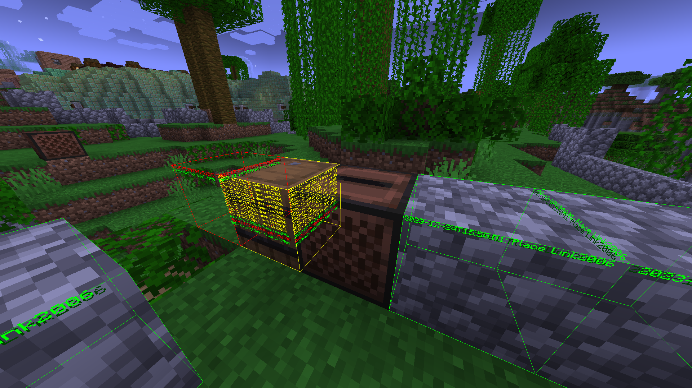
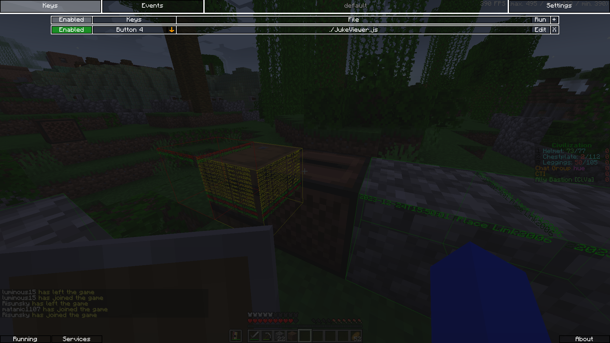
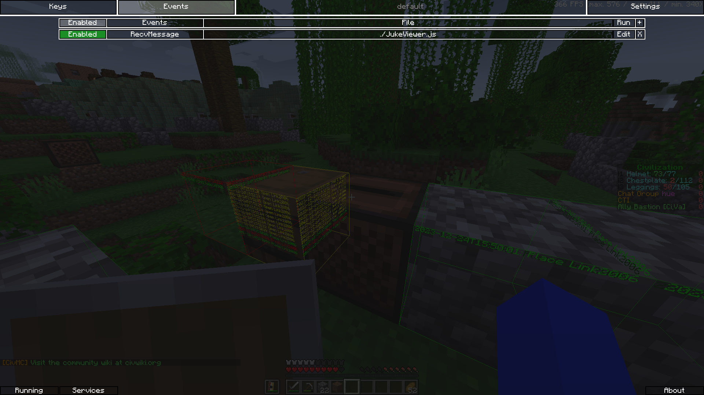

# JukeViewer
[JSMacros](https://www.curseforge.com/minecraft/mc-mods/jsmacros) script that renders JukeAlert events

# Usage

You should be using [JSMacros](https://www.curseforge.com/minecraft/mc-mods/jsmacros) for your version of Minecraft

Copy the JukeViewer.js file to `.minecraft/config/jsMacros/Macros`

Once that is installed, open the JSMacros menu and add the script to the "RecvMessage" event and as a Key event as well.

